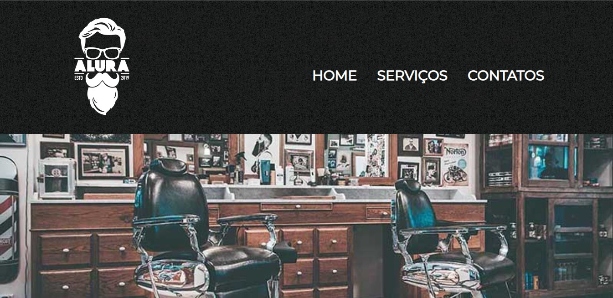

## Site-Barbearia
Desenvolvimento 100% em html e css para criação de um portfólio de barbearia, com algumas práticas de responsividade. 💻

Projeto final do curso de HTML e CSS da Alura + Oracle(ONE).

Pontos importantes que aprendi.
. Construção completa de uma página utilizando HTML e CSS.
. Utilização de API's.
. CSS responsivo.
. Semântica e código limpo no CSS.
. Pós processamento CSS
. Resolução de conflitos de estilos.
. Criação de sites acessíveis a pessoas com baixa visão.
. Criação de códigos de fácil manutenção.

Meus agradecimentos aos professores Pedro Marins pela didática incrível e ao Weslley Bastos por sempre estar disposto a tirar dúvidas e ajudar ativamente no processo de evolução dos alunos!

Alura Latam
#ONE #OracleNextEducation #Alura #CSS #transiçãodecarreira #frontend #HTML

site: https://www.barbearia-aurora.netlify.app

## Visualização

